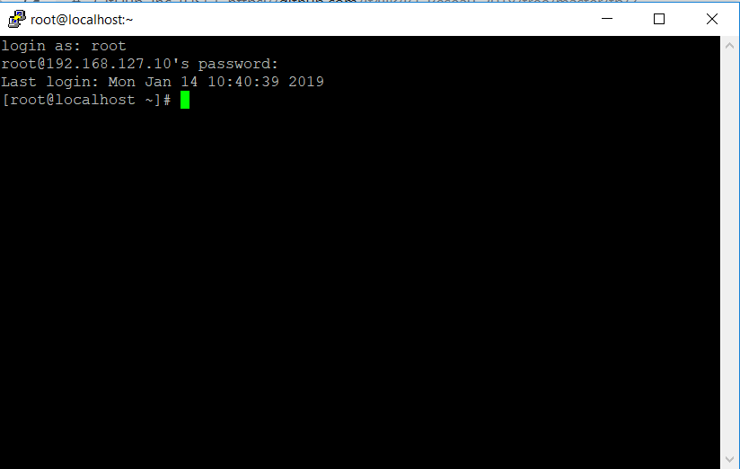
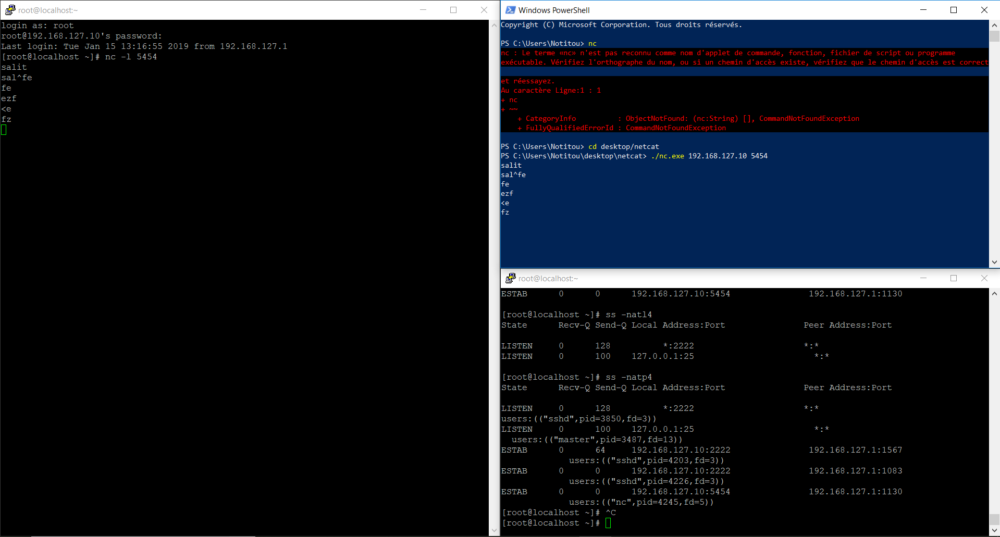

# TP3 Reseau

# Sommaire

* [I. Création et utilisation simples d'un VM CentOS](#i-création-et-utilisation-simples-dune-vm-centos)
* [II. Notion de ports et SSH](#II.-Notion-de-ports-et-SSH)
* [III. SSH](#III.-SSH)
* [IV. FireWall](#IV.-FireWall)
* [V. Netcat](#V.-Netcat)
* [VI. Routage statique (Partie à 2 tp3)](#VI.-Routage-statique-(Partie-à-2-tp3))

# I. Création et utilisation simples d'une VM CentOS

## Ping hôte à la VM
```bash
PS C:\Users\Notitou> ping 192.168.127.10

Envoi d’une requête 'Ping'  192.168.127.10 avec 32 octets de données :
Réponse de 192.168.127.10 : octets=32 temps<1ms TTL=64
Réponse de 192.168.127.10 : octets=32 temps<1ms TTL=64
Réponse de 192.168.127.10 : octets=32 temps<1ms TTL=64
Réponse de 192.168.127.10 : octets=32 temps<1ms TTL=64

Statistiques Ping pour 192.168.127.10:
    Paquets : envoyés = 4, reçus = 4, perdus = 0 (perte 0%),
Durée approximative des boucles en millisecondes :
    Minimum = 0ms, Maximum = 0ms, Moyenne = 0ms
```
---
## Ping de la VM à l'hôte

```bash
[root@localhost ~]# ping 192.168.127.1
PING 192.168.127.1 (192.168.127.1) 56(84) bytes of data.
64 bytes from 192.168.127.1: icmp_seq=1 ttl=128 time=0.215 ms
64 bytes from 192.168.127.1: icmp_seq=2 ttl=128 time=0.452 ms
64 bytes from 192.168.127.1: icmp_seq=3 ttl=128 time=0.397 ms
64 bytes from 192.168.127.1: icmp_seq=4 ttl=128 time=0.372 ms
--- 192.168.127.1 ping statistics ---
4 packets transmitted, 4 received, 0% packet loss, time 3006ms
rtt min/avg/max/mdev = 0.215/0.359/0.452/0.088 ms

```
---
## Table de routage de l'hôte
```bash
PS C:\Users\Notitou> route print -4
===========================================================================
Liste d Interfaces
  5...70 5a 0f 1e e0 1e ......Realtek PCIe FE Family Controller
 12...0a 00 27 00 00 0c ......VirtualBox Host-Only Ethernet Adapter #2
 22...46 1c a8 7b 10 ed ......Microsoft Wi-Fi Direct Virtual Adapter #5
 26...44 1c a8 7b 10 ed ......Microsoft Wi-Fi Direct Virtual Adapter #6
 30...44 1c a8 7b 10 ed ......Realtek RTL8723BE 802.11 bgn Wi-Fi Adapter
 20...44 1c a8 7b 10 ee ......Bluetooth Device (Personal Area Network)
  1...........................Software Loopback Interface 1
===========================================================================

IPv4 Table de routage
===========================================================================
Itinéraires actifs :
Destination réseau    Masque réseau  Adr. passerelle   Adr. interface Métrique
          0.0.0.0          0.0.0.0      10.33.3.253      10.33.3.184     55
        10.33.0.0    255.255.252.0         On-link       10.33.3.184    311
      10.33.3.184  255.255.255.255         On-link       10.33.3.184    311
      10.33.3.255  255.255.255.255         On-link       10.33.3.184    311
        127.0.0.0        255.0.0.0         On-link         127.0.0.1    331
        127.0.0.1  255.255.255.255         On-link         127.0.0.1    331
  127.255.255.255  255.255.255.255         On-link         127.0.0.1    331
    192.168.127.0    255.255.255.0         On-link     192.168.127.1    281
    192.168.127.1  255.255.255.255         On-link     192.168.127.1    281
  192.168.127.255  255.255.255.255         On-link     192.168.127.1    281
        224.0.0.0        240.0.0.0         On-link         127.0.0.1    331
        224.0.0.0        240.0.0.0         On-link     192.168.127.1    281
        224.0.0.0        240.0.0.0         On-link       10.33.3.184    311
  255.255.255.255  255.255.255.255         On-link         127.0.0.1    331
  255.255.255.255  255.255.255.255         On-link     192.168.127.1    281
  255.255.255.255  255.255.255.255         On-link       10.33.3.184    311
===========================================================================
Itinéraires persistants :
  Aucun
```
---
## Table de routage de la VM
```bash
[root@localhost ~]# ip route
default via 10.0.2.2 dev enp0s3 proto dhcp metric 100
10.0.2.0/24 dev enp0s3 proto kernel scope link src 10.0.2.15 metric 100
169.254.0.0/16 dev enp0s8 scope link metric 1003
192.168.127.0/24 dev enp0s8 proto kernel scope link src 192.168.127.10

```
---
## Lignes qui permettent de discuter via host-only

Sur l'host:

```bash
 192.168.127.0    255.255.255.0         On-link     192.168.127.1    281
```

Sur la VM :
```bash
192.168.127.0/24 dev enp0s8 proto kernel scope link src 192.168.127.10
```
---
## Utilisation de curl
```bash
[root@localhost ~]# curl google.com
<HTML><HEAD><meta http-equiv="content-type" content="text/html;charset=utf-8">
<TITLE>301 Moved</TITLE></HEAD><BODY>
<H1>301 Moved</H1>
The document has moved
<A HREF="http://www.google.com/">here</A>.
</BODY></HTML>
```
---
## Utilisation de dig ynov.com
```bash
;; SERVER: 10.33.10.20#53(10.33.10.20)
```
---
## Utilisation de dig google.com
```bash
;; SERVER: 10.33.10.20#53(10.33.10.20)
```
---
# II. Notion de ports et SSH

## Utilisation de la commande "ss -4"
```bash
[root@localhost ~]# ss -4
Netid  State      Recv-Q Send-Q Local Address:Port                 Peer Address:Port
tcp    ESTAB      0      0      192.168.127.10:ssh                  192.168.127.1:32487
```
---
## Utilisation de la commande "ss -t"

```bash
[root@localhost ~]# ss -t
State      Recv-Q Send-Q Local Address:Port                 Peer Address:Port   
ESTAB      0      64     192.168.127.10:ssh                  192.168.127.1:tcoaddressbook
```
---
## Utilisation de la commande "ss -l"
```bash
tcp    LISTEN     0      128     *:ssh                   *:*
tcp    LISTEN     0      128    :::ssh                  :::*
```
---
# III. SSH



---
# IV. FireWall

Nous avons modifié le fichier `sshd_config` pour changer le port, et l'avons mis au port 2222.
Puis avant exécuter la commande `ss -naltp4` pour bien vérifié que le port a bien été modifié.
```bash
[root@localhost ssh]# ss -naltp4
State       Recv-Q Send-Q                                                 Local Address:Port                                                                Peer Address:Port
LISTEN      0      128                                                                *:2222                                                                           *:*             
```
---
On ne peut pas se connecter au nouveau port car le FireWall nous en empêche, pour pouvoir se reconnecter nous devons ajouter et autorisé le nouveau port grâce au FireWall.

```bash
[root@localhost ssh]# firewall-cmd --add-port=2222/tcp --permanent
```
Puis pour que les modifications soit actives : 
```bash
[root@localhost ssh]#firewall-cmd --reload
```
Puis pour vérifié que les modifications se sont bien faites avant d'essayer de se connecter nous pouvons faire cela : 
```bash
[root@localhost ssh]# firewall-cmd --list-all
public (active)
  target: default
  icmp-block-inversion: no
  interfaces: enp0s3 enp0s8
  sources:
  services: ssh dhcpv6-client
  ports: 2222/tcp
  protocols:
  masquerade: no
  forward-ports:
  source-ports:
  icmp-blocks:
  rich rules:

```
---
## V. Netcat

J'ai fait le netcat entre mon PowerShell et ma VM :


Puis les résultats du 3ème terminal pendant le netcat sont (données importante pas en commentaire) :
```bash
[root@localhost ~]# ss -natp4
State      Recv-Q Send-Q Local Address:Port               Peer Address:Port     
#LISTEN     0      128          *:2222                     *:*     #              users:(("sshd",pid=3850,fd=3))
#LISTEN     0      100    127.0.0.1:25                       *:*   #                users:(("master",pid=3487,fd=13))
#ESTAB      0      64     192.168.127.10:2222               192.168.127.1:1567                users:(("sshd",pid=4203,fd=3))
#ESTAB      0      0      192.168.127.10:2222               192.168.127.1:1083                users:(("sshd",pid=4226,fd=3))
ESTAB      0      0      192.168.127.10:5454               192.168.127.1:1130                users:(("nc",pid=4245,fd=5))
```
---
# VI. Routage statique (Partie à 2 tp3)

### 1. Préparation des hôtes (vos PCs)
---
#### Ping à travers le câble Ethernet

```bash
PS C:\Users\Notitou> ping 192.168.255.1

Envoi d’une requête 'Ping'  192.168.255.1 avec 32 octets de données :
Réponse de 192.168.255.1 : octets=32 temps=2 ms TTL=128
Réponse de 192.168.255.1 : octets=32 temps=1 ms TTL=128
Réponse de 192.168.255.1 : octets=32 temps=1 ms TTL=128
Réponse de 192.168.255.1 : octets=32 temps=1 ms TTL=128

Statistiques Ping pour 192.168.255.1:
    Paquets : envoyés = 4, reçus = 4, perdus = 0 (perte 0%),
Durée approximative des boucles en millisecondes :
    Minimum = 1ms, Maximum = 2ms, Moyenne = 1ms
```

Changement d'ip sur les cartes ethernet pour être dans le réseau 192.168.112.0/30

---

#### Préparation Virtual Box

Rémi et Louis ont changé leurs IP de leur carte Host-Only et de leur VM par celle recquise.
---
#### Check
---
Ping PC 1 -> PC 2
```powershell
PS C:\Users\Notitou> ping 192.168.112.2

Envoi d’une requête 'Ping'  192.168.112.2 avec 32 octets de données :
Réponse de 192.168.112.2 : octets=32 temps=2 ms TTL=128
Réponse de 192.168.112.2 : octets=32 temps=2 ms TTL=128
Réponse de 192.168.112.2 : octets=32 temps=2 ms TTL=128
Réponse de 192.168.112.2 : octets=32 temps=2 ms TTL=128

Statistiques Ping pour 192.168.112.2:
    Paquets : envoyés = 4, reçus = 4, perdus = 0 (perte 0%),
Durée approximative des boucles en millisecondes :
    Minimum = 2ms, Maximum = 2ms, Moyenne = 2ms
```
---
Ping PC 1 -> VM 1

```powershell
PS C:\Users\Notitou> ping 192.168.101.10

Envoi d’une requête 'Ping'  192.168.101.10 avec 32 octets de données :
Réponse de 192.168.101.10 : octets=32 temps<1ms TTL=64
Réponse de 192.168.101.10 : octets=32 temps<1ms TTL=64
Réponse de 192.168.101.10 : octets=32 temps<1ms TTL=64
Réponse de 192.168.101.10 : octets=32 temps<1ms TTL=64

Statistiques Ping pour 192.168.101.10:
    Paquets : envoyés = 4, reçus = 4, perdus = 0 (perte 0%),
Durée approximative des boucles en millisecondes :
    Minimum = 0ms, Maximum = 0ms, Moyenne = 0ms
```
---

Ping VM1 -> PC1

```bash
[root@localhost ~]# ping 192.168.101.1
PING 192.168.101.1 (192.168.101.1) 56(84) bytes of data.
64 bytes from 192.168.101.1: icmp_seq=1 ttl=128 time=0.270 ms
64 bytes from 192.168.101.1: icmp_seq=2 ttl=128 time=0.684 ms
64 bytes from 192.168.101.1: icmp_seq=3 ttl=128 time=0.401 ms
64 bytes from 192.168.101.1: icmp_seq=4 ttl=128 time=0.409 ms
64 bytes from 192.168.101.1: icmp_seq=5 ttl=128 time=0.328 ms
64 bytes from 192.168.101.1: icmp_seq=6 ttl=128 time=0.452 ms
^X^C
--- 192.168.101.1 ping statistics ---
6 packets transmitted, 6 received, 0% packet loss, time 5002ms
rtt min/avg/max/mdev = 0.270/0.424/0.684/0.130 ms
```
---
Ping PC2 -> PC1

```console
PS C:\Users\louis_tbixp39> ping 192.168.112.1

Envoi d’une requête 'Ping'  192.168.112.1 avec 32 octets de données :
Réponse de 192.168.112.1 : octets=32 temps=3 ms TTL=128
Réponse de 192.168.112.1 : octets=32 temps=1 ms TTL=128
Réponse de 192.168.112.1 : octets=32 temps=2 ms TTL=128
Réponse de 192.168.112.1 : octets=32 temps=2 ms TTL=128

Statistiques Ping pour 192.168.112.1:
    Paquets : envoyés = 4, reçus = 4, perdus = 0 (perte 0%),
Durée approximative des boucles en millisecondes :
    Minimum = 1ms, Maximum = 3ms, Moyenne = 2ms
```
---
Ping VM1 -> PC1

```bash
[root@localhost ~]# ping 192.168.101.1
PING 192.168.101.1 (192.168.101.1) 56(84) bytes of data.
64 bytes from 192.168.101.1: icmp_seq=1 ttl=128 time=0.270 ms
64 bytes from 192.168.101.1: icmp_seq=2 ttl=128 time=0.684 ms
64 bytes from 192.168.101.1: icmp_seq=3 ttl=128 time=0.401 ms
64 bytes from 192.168.101.1: icmp_seq=4 ttl=128 time=0.409 ms
64 bytes from 192.168.101.1: icmp_seq=5 ttl=128 time=0.328 ms
64 bytes from 192.168.101.1: icmp_seq=6 ttl=128 time=0.452 ms
^X^C
--- 192.168.101.1 ping statistics ---
6 packets transmitted, 6 received, 0% packet loss, time 5002ms
rtt min/avg/max/mdev = 0.270/0.424/0.684/0.130 ms
```
---
Ping VW2 -> PC2

```console
[louis@localhost ~]$ ping 192.168.112.2                                         PING 192.168.112.2 (192.168.112.2) 56(84) bytes of data.
64 bytes from 192.168.112.2: icmp_seq=1 ttl=127 time=0.483 ms
64 bytes from 192.168.112.2: icmp_seq=2 ttl=127 time=1.05 ms
64 bytes from 192.168.112.2: icmp_seq=3 ttl=127 time=1.23 ms
64 bytes from 192.168.112.2: icmp_seq=4 ttl=127 time=1.16 ms
^C
--- 192.168.112.2 ping statistics ---
4 packets transmitted, 4 received, 0% packet loss, time 3006ms
rtt min/avg/max/mdev = 0.483/0.985/1.238/0.299 ms
```
---
Ping PC2 -> VM2

```bash
PS C:\Users\louis_tbixp39> ping 192.168.102.10

Envoi d’une requête 'Ping'  192.168.102.10 avec 32 octets de données :
Réponse de 192.168.102.10 : octets=32 temps<1ms TTL=64
Réponse de 192.168.102.10 : octets=32 temps<1ms TTL=64
Réponse de 192.168.102.10 : octets=32 temps<1ms TTL=64
Réponse de 192.168.102.10 : octets=32 temps<1ms TTL=64

Statistiques Ping pour 192.168.102.10:
    Paquets : envoyés = 4, reçus = 4, perdus = 0 (perte 0%),
Durée approximative des boucles en millisecondes :
    Minimum = 0ms, Maximum = 0ms, Moyenne = 0ms
```
----

### 2. Configuration du routage

- PC 1

```Powershell
PS C:\WINDOWS\system32> route add 192.168.102.1/24 mask 255.255.255.0 192.168.112.2
 OK!
PS C:\WINDOWS\system32> ping 192.168.102.1

Envoi d’une requête 'Ping'  192.168.102.1 avec 32 octets de données :
Réponse de 192.168.102.1 : octets=32 temps=2 ms TTL=127
Réponse de 192.168.102.1 : octets=32 temps=2 ms TTL=127
Réponse de 192.168.102.1 : octets=32 temps=2 ms TTL=127
Réponse de 192.168.102.1 : octets=32 temps=2 ms TTL=127

Statistiques Ping pour 192.168.102.1:
    Paquets : envoyés = 4, reçus = 4, perdus = 0 (perte 0%),
Durée approximative des boucles en millisecondes :
    Minimum = 2ms, Maximum = 2ms, Moyenne = 2ms
````
---
- PC 2

```powershell
PS C:\WINDOWS\system32> route add 192.168.101.1/24 mask 255.255.255.0 192.168.112.1
 OK!
PS C:\WINDOWS\system32> ping 192.168.101.1

Envoi d’une requête 'Ping'  192.168.101.1 avec 32 octets de données :
Réponse de 192.168.101.1 : octets=32 temps=3 ms TTL=127
Réponse de 192.168.101.1 : octets=32 temps=2 ms TTL=127
Réponse de 192.168.101.1 : octets=32 temps=1 ms TTL=127
Réponse de 192.168.101.1 : octets=32 temps=2 ms TTL=127

Statistiques Ping pour 192.168.101.1:
    Paquets : envoyés = 4, reçus = 4, perdus = 0 (perte 0%),
Durée approximative des boucles en millisecondes :
    Minimum = 1ms, Maximum = 3ms, Moyenne = 2ms
```
---
- VM 1

```bash
[root@localhost ~]$ sudo ip route add 192.168.112.0/30 via 192.168.101.1 dev enp0s8
[root@localhost ~]$ sudo ip route add 192.168.102.0/24 via 192.168.101.1 dev enp0s8
[root@localhost ~]# ping 192.168.112.2
PING 192.168.112.2 (192.168.112.2) 56(84) bytes of data.
64 bytes from 192.168.112.2: icmp_seq=1 ttl=127 time=2.63 ms
64 bytes from 192.168.112.2: icmp_seq=2 ttl=127 time=3.58 ms
64 bytes from 192.168.112.2: icmp_seq=3 ttl=127 time=3.09 ms
64 bytes from 192.168.112.2: icmp_seq=4 ttl=127 time=3.90 ms
64 bytes from 192.168.112.2: icmp_seq=5 ttl=127 time=3.01 ms
^C
--- 192.168.112.2 ping statistics ---
5 packets transmitted, 5 received, 0% packet loss, time 4012ms
rtt min/avg/max/mdev = 2.630/3.245/3.900/0.449 ms
[root@localhost ~]# ping 192.168.102.1
PING 192.168.102.1 (192.168.102.1) 56(84) bytes of data.
64 bytes from 192.168.102.1: icmp_seq=1 ttl=126 time=2.82 ms
64 bytes from 192.168.102.1: icmp_seq=2 ttl=126 time=3.13 ms
64 bytes from 192.168.102.1: icmp_seq=3 ttl=126 time=2.93 ms
64 bytes from 192.168.102.1: icmp_seq=4 ttl=126 time=2.86 ms
^C
--- 192.168.102.1 ping statistics ---
4 packets transmitted, 4 received, 0% packet loss, time 3008ms
rtt min/avg/max/mdev = 2.829/2.939/3.130/0.122 ms
```
---
- VM 2

```bash
[louis@localhost ~]$ sudo ip route add 192.168.112.0/30 via 192.168.102.1 dev enp0s8
[louis@localhost ~]$ sudo ip route add 192.168.101.0/24 via 192.168.102.1 dev enp0s8
[louis@localhost ~]$ ping 192.168.112.1
PING 192.168.112.1 (192.168.112.1) 56(84) bytes of data.
64 bytes from 192.168.112.1: icmp_seq=1 ttl=127 time=5.16 ms
64 bytes from 192.168.112.1: icmp_seq=2 ttl=127 time=2.38 ms
64 bytes from 192.168.112.1: icmp_seq=3 ttl=127 time=2.83 ms
64 bytes from 192.168.112.1: icmp_seq=4 ttl=127 time=3.24 ms
^C
--- 192.168.112.1 ping statistics ---
4 packets transmitted, 4 received, 0% packet loss, time 3010ms
rtt min/avg/max/mdev = 2.384/3.406/5.163/1.060 ms
[louis@localhost ~]$ ping 192.168.101.1
PING 192.168.101.1 (192.168.101.1) 56(84) bytes of data.
64 bytes from 192.168.101.1: icmp_seq=1 ttl=126 time=2.27 ms
64 bytes from 192.168.101.1: icmp_seq=2 ttl=126 time=2.54 ms
64 bytes from 192.168.101.1: icmp_seq=3 ttl=126 time=2.43 ms
64 bytes from 192.168.101.1: icmp_seq=4 ttl=126 time=2.83 ms
^C
--- 192.168.101.1 ping statistics ---
4 packets transmitted, 4 received, 0% packet loss, time 3007ms
rtt min/avg/max/mdev = 2.278/2.522/2.831/0.201 ms
```
---
#### Ping VM1 

- Ping VM 1 -> PC 1
```bash
[root@localhost etc]# ping pc1.tp3.b1
PING pc1 (192.168.112.1) 56(84) bytes of data.
64 bytes from pc1 (192.168.112.1): icmp_seq=1 ttl=127 time=0.237 ms
64 bytes from pc1 (192.168.112.1): icmp_seq=2 ttl=127 time=0.477 ms
64 bytes from pc1 (192.168.112.1): icmp_seq=3 ttl=127 time=0.461 ms
64 bytes from pc1 (192.168.112.1): icmp_seq=4 ttl=127 time=0.504 ms
^C
--- pc1 ping statistics ---
4 packets transmitted, 4 received, 0% packet loss, time 3004ms
rtt min/avg/max/mdev = 0.237/0.419/0.504/0.109 ms
```

- Ping VM 1 -> PC 2

```bash
[root@localhost etc]# ping pc2.tp3.b1
PING pc2 (192.168.112.2) 56(84) bytes of data.
64 bytes from pc2 (192.168.112.2): icmp_seq=1 ttl=127 time=2.66 ms
64 bytes from pc2 (192.168.112.2): icmp_seq=2 ttl=127 time=2.78 ms
64 bytes from pc2 (192.168.112.2): icmp_seq=3 ttl=127 time=2.68 ms
64 bytes from pc2 (192.168.112.2): icmp_seq=4 ttl=127 time=2.73 ms
64 bytes from pc2 (192.168.112.2): icmp_seq=5 ttl=127 time=3.27 ms
^C
--- pc2 ping statistics ---
5 packets transmitted, 5 received, 0% packet loss, time 4013ms
rtt min/avg/max/mdev = 2.669/2.829/3.279/0.238 ms
```

- Ping VM 1 -> VM 2

```bash
[root@localhost etc]# ping vm2.tp3.b1
PING vm2 (192.168.102.10) 56(84) bytes of data.
64 bytes from vm2 (192.168.102.10): icmp_seq=1 ttl=62 time=2.82 ms
^[[A64 bytes from vm2 (192.168.102.10): icmp_seq=2 ttl=62 time=3.09 ms
64 bytes from vm2 (192.168.102.10): icmp_seq=3 ttl=62 time=3.83 ms
64 bytes from vm2 (192.168.102.10): icmp_seq=4 ttl=62 time=3.21 ms
64 bytes from vm2 (192.168.102.10): icmp_seq=5 ttl=62 time=3.54 ms
^C
--- vm2 ping statistics ---
5 packets transmitted, 5 received, 0% packet loss, time 4007ms
rtt min/avg/max/mdev = 2.829/3.302/3.834/0.357 ms

```

- Ping VM 2 -> PC 1

```bash
[louis@localhost /]$ ping pc1.tp3.b1
PING pc1 (192.168.112.1) 56(84) bytes of data.
64 bytes from pc1 (192.168.112.1): icmp_seq=1 ttl=127 time=2.27 ms
64 bytes from pc1 (192.168.112.1): icmp_seq=2 ttl=127 time=2.62 ms
64 bytes from pc1 (192.168.112.1): icmp_seq=3 ttl=127 time=2.43 ms
64 bytes from pc1 (192.168.112.1): icmp_seq=4 ttl=127 time=2.29 ms
^C
--- pc1 ping statistics ---
4 packets transmitted, 4 received, 0% packet loss, time 3005ms
rtt min/avg/max/mdev = 2.271/2.406/2.622/0.151 ms
```

- Ping VM 2 -> PC 2

```bash
[louis@localhost /]$ ping pc2.tp3.b1
PING pc2 (192.168.112.2) 56(84) bytes of data.
64 bytes from pc2 (192.168.112.2): icmp_seq=1 ttl=127 time=0.356 ms
64 bytes from pc2 (192.168.112.2): icmp_seq=2 ttl=127 time=0.662 ms
64 bytes from pc2 (192.168.112.2): icmp_seq=3 ttl=127 time=0.600 ms
64 bytes from pc2 (192.168.112.2): icmp_seq=4 ttl=127 time=0.625 ms
^C
--- pc2 ping statistics ---
4 packets transmitted, 4 received, 0% packet loss, time 3002ms
rtt min/avg/max/mdev = 0.356/0.560/0.662/0.123 ms
```

- Ping VM 2 -> VM 1

```bash
[louis@localhost /]$ ping vm1.tp3.b1
PING vm1 (192.168.101.10) 56(84) bytes of data.
64 bytes from vm1 (192.168.101.10): icmp_seq=1 ttl=62 time=2.50 ms
64 bytes from vm1 (192.168.101.10): icmp_seq=2 ttl=62 time=2.82 ms
64 bytes from vm1 (192.168.101.10): icmp_seq=3 ttl=62 time=2.26 ms
64 bytes from vm1 (192.168.101.10): icmp_seq=4 ttl=62 time=2.53 ms
^C
--- vm1 ping statistics ---
4 packets transmitted, 4 received, 0% packet loss, time 3005ms
rtt min/avg/max/mdev = 2.261/2.530/2.820/0.207 ms
```
---
### 3. Netcat VM 1 -> VM 2

```bash
[louis@localhost /]$ nc vm1.tp3.b1 5454
salut
je suis la vm1
et moi la vm2
ahahah
```